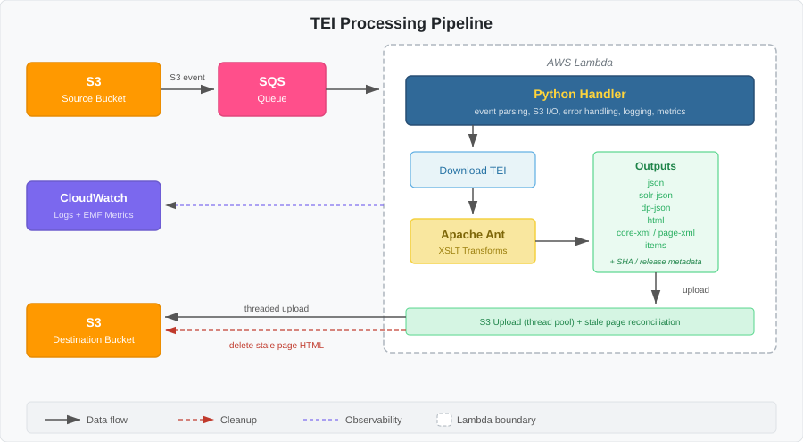

# Cambridge Digital Collection TEI Processing

The code in this repository is used for processing TEI item data into all the formats used by the Cambridge Digital Collections Platform, namely:

1. `core-xml` [*Optional*] contains the processed metadata (including html page files and collection information)
2. `dp-json` contains the JSON files that contain the metadata necessary for items to be processed in Cambridge University Library’s Digital Preservation pipeline.
3. `html` directory contains html files for every page transcription or translation along with associated UI resources (inline diagrams, css, javascript)
4. `items` [*Optional*] contains a copy of the original, unmodified, source TEI XML file.
5. `json` contains the JSON files required for the viewer to function
6. `page-xml` [*Optional*] contains TEI XML files for each individual page.
7. `solr-json` contains the JSON files that contain the metadata and textual content for indexing in solr.

The lambda is a python wrapper that receives S3 notifications that trigger an Apache Ant XSLT transformation build to create all the desired outputs. The python wrapper then uploads them to the destination bucket. It also removes any stale page HTML from that item when their pages are no longer part of the original source file. The lambda handles partial batch failures, distinguishes transient from permanent errors, emits structured JSON logs, and optionally attaches SHA-256 and release-status metadata to uploaded objects to skip unchanged files when copying to the destination bucket.



The application is dockerised. There are two versions:

1. One that creates the environment for running in an AWS Lambda, which relies on a wide range of AWS infrastructure to function.
2. The other version runs off locally stored data files. This is the version that’s best suited for implementation within a CI/CD system or for running local builds.

## Prerequisites

- [Docker](https://docs.docker.com/get-docker/)
- Python 3.x (if running tests)

## Instructions for running the AWS Lambda Development version locally

### Prerequisites

Environment variables with the necessary AWS credentials stored in the following variables:
- `AWS_ACCESS_KEY_ID`
- `AWS_SECRET_ACCESS_KEY`
- `AWS_SESSION_TOKEN`

All other environment variables necessary for CUDL are stored in `.env`, such as the source and destination buckets.

### Running the AWS container locally

```bash
docker compose -f docker-compose-aws-dev.yml up --build
```

**NB:** This `docker-compose-aws-dev.yml` must not be used when building the container for deployment within AWS. Instead, follow the instructions below.

Set `LOG_LEVEL=DEBUG` in your `.env` file (or export it) for verbose output when debugging.

### Processing a file

The AWS Lambda responds to SQS messages. To transform a file, you need to submit a JSON file with the SQS structure with a `POST` request to `http://localhost:9000/2015-03-31/functions/function/invocations`:

```bash
curl -X POST \
  -H 'Content-Type: application/json' \
  'http://localhost:9000/2015-03-31/functions/function/invocations' \
  --data-binary "@./test/sns-tei-source-change.json"
```

Assuming you have the required permissions to access the resources, this container will create all the necessary outputs and, if successful, copy them to their S3 bucket destination.

**NOTE:** The lambda will attempt to download the item mentioned in the sample notification. You will consequently only be able to successfully run this lambda locally after you have successfully logged into AWS and stored your access keys (as above).

This information is coded in escaped JSON contained within the `body` property. If you search for ‘bucket’, you will find the name of the bucket (‘rmm98-sandbox-cudl-data-source’ at present) and the filename is stored within object key property (`items/data/tei/MS-ADD-03975/MS-ADD-03975.xml` at present). You will need to update these to buckets/items that exist and which you have access to.

## Instructions for running the local non-AWS container

### Prerequisites

Two directories at the root level of the repository:

* `data`, which contains the source data for your collection. This can be copied from the relevant S3 source bucket.
* `dist`, which will contain the finished outputs.

### Building the container and processing data

You must specify the file you want to process in the environment variable called `TEI_FILE` before you mount the container. This contains the path to the source file, relative to the root of the `./data`. This file will be processed as soon as the container is run.
 
To process MS-ADD-03975:

```bash
export TEI_FILE=items/data/tei/MS-ADD-03975/MS-ADD-03975.xml
docker compose -f docker-compose-local.yml up --build
```

`TEI_FILE` also accepts wildcards. The following will rebuild files for MS-ADD-04000 to MS-ADD-04009:

```bash
export TEI_FILE=items/data/tei/**/MS-ADD-0400*.xml
docker compose -f docker-compose-local.yml up --build
```

You cannot pass multiple files (with paths) to the container. It only accepts a single file or wildcards.

If the `TEI_FILE` environment variable is not set, the container will assume that you want to process all files (**/*.xml) in `./data`.

Set `LOG_LEVEL=DEBUG` in your `.env` file (or export it) for verbose output when debugging.

## Environment variables

All compose files inherit from `docker-compose-base.yml`, which loads a `.env` file. Variables marked **Lambda** are used when the container runs as an AWS Lambda. Variables marked **Local compose** only apply when running via `docker-compose-local.yml` or `docker-compose-aws-dev.yml`.

### AWS credentials (needed for local development work)

These are only needed when running the container locally against real AWS resources. In Lambda, the execution role provides credentials automatically.

| Variable | Default | Description |
|---|---|---|
| `AWS_ACCESS_KEY_ID` | — | AWS access key. |
| `AWS_SECRET_ACCESS_KEY` | — | AWS secret key. |
| `AWS_SESSION_TOKEN` | — | Temporary session token (required when using SSO/assumed roles). |

### Core processing

| Variable | Default | Scope | Description |
|---|---|---|---|
| `AWS_OUTPUT_BUCKET` | `""` | Lambda | S3 bucket for processed outputs. **Required** for Lambda. |
| `ANT_TARGET` | `full` | Lambda, Local compose | Ant build target to execute. |
| `ENVIRONMENT` | — | Ant build | Set to `local` by both local compose files. Controls whether Ant copies outputs locally or to S3. |
| `TEI_FILE` | — | Local compose | Path (relative to `./data`) of the TEI file to process. Accepts wildcards. If unset, all `**/*.xml` files in `./data` are processed. |
| `XSLT_FAIL_ON_ERROR` | `true` | Lambda, Local compose | Whether the XSLT transform should abort on error. Set to `false` when running bulk transformations locally. Otherwise a malformed TEI would cause the batch to fail entirely. |

### Search / Solr integration

Passed through to the XSLT stylesheets via the Ant build. These variables are used for lookups when indexing an item to determine which collection(s) it belongs to.

| Variable | Default | Scope | Description |
|---|---|---|---|
| `SEARCH_HOST` | `""` | Lambda, Local compose | Hostname of the Solr/search service. **Required** for Lambda. Local compose defaults to `host.docker.internal`. |
| `SEARCH_PORT` | `""` | Lambda, Local compose | Port for the search service. |
| `SEARCH_COLLECTION_PATH` | `collections` | Lambda, Local compose | URL path segment for the collection endpoint. |

### Skip / feature flags

These flags disable individual processing or copy steps. They all default to options that replicate previous behaviour.

| Variable | Default (Lambda) | Default (Local compose) | Description |
|---|---|---|---|
| `SKIP_COPY_TEI_WEB_ASSETS` | `false` | `true` | Skip copying TEI web assets (CSS, fonts) to the output. |
| `SKIP_PAGE_XML_COPY` | — | `true` | Skip copying page XML files to the output destination. |
| `SKIP_CORE_XML_COPY` | — | `true` | Skip copying core XML files to the output destination. |
| `SKIP_TEI_FULL_COPY` | — | `false` | Skip copying the full original TEI files to the output. |

### Per-object metadata and conditional uploads

When enabled, the Lambda attaches user-metadata to each uploaded S3 object and uses those metadata fields to skip unchanged uploads.

| Variable | Default | Scope | Description |
|---|---|---|---|
| `ENABLE_SHA_METADATA` | `false` | Lambda, Local compose | Attach `content-sha256` (hex SHA-256 of the file bytes) to each uploaded object. |
| `ENABLE_RELEASE_STATUS_METADATA` | `false` | Lambda, Local compose | Derive release status from the TEI via XPath and attach `release-status` (`released` or `draft`) to each uploaded object. |

**Behaviour:**

- When both flags are `false`, all outputs are uploaded unconditionally (original behaviour).
- If the destination object itself is missing, it is always uploaded regardless of flag state.
- When one or both flags are enabled, the Lambda compares only the enabled metadata fields against the destination object. The file is uploaded if:
  - the file is missing on the destination
  - any enabled field is missing or different on the destination
- If all enabled fields are present and match, the upload is skipped for that file.

### Embedded TEI SHA

This flag adds a top-level field (`teiSha256`) containing the TEI item's SHA-256 into the core-xml metadata file, which is then inherited by the downstream solr, viewer and digital preservation json files.

| Variable | Default | Scope | Description |
|---|---|---|---|
| `ENABLE_TEI_SHA_IN_CORE_XML` | `false` | Lambda, Local compose | Embed the hex SHA-256 of the source TEI bytes as a top-level `teiSha256` field in core-xml. The hash matches the `content-sha256` user-metadata that `ENABLE_SHA_METADATA` sets on `items/data/tei/<file>.xml` in the output bucket, so consumers can reconcile a derived JSON record against its source TEI without an extra `HEAD` call. It can also be used to track content changes in external systems consuming the data. |

**Behaviour:**

- When unset or set to `false` (default), nothing is computed and no `teiSha256` field appears in any output, preserving backwards-compatibility.
- When `true`, Ant's `<checksum>` task writes one `.sha256` sidecar per source TEI to a tmp directory. `msTeiPreFilter.xsl` reads its own file's sidecar via `unparsed-text()` during the transform and emits `teiSha256` at the top of core-xml. Sidecars are deleted once the transform completes. Per-file SHAs are emitted correctly for both single-file (Lambda; local with a concrete `TEI_FILE`) and wildcard (`TEI_FILE=items/data/tei/**/*.xml`) invocations. The flag is read directly by Ant — no Python orchestration is involved.

### Monitoring and logging

| Variable | Default | Scope | Description |
|---|---|---|---|
| `LOG_LEVEL` | `INFO` | Lambda, Local compose | Logging level for structured JSON logs (`DEBUG`, `INFO`, `WARNING`, `ERROR`, `CRITICAL`). When running locally at `INFO` level (the default), Ant's stdout is streamed directly to the terminal in real time. At other log levels, stdout is captured and processed through the structured logger. |
| `EMIT_EMF_METRICS` | `false` | Lambda | Emit [CloudWatch Embedded Metric Format](https://docs.aws.amazon.com/AmazonCloudWatch/latest/monitoring/CloudWatch_Embedded_Metric_Format_Specification.html) metrics. |
| `LAMBDA_TIMEOUT_MARGIN_MS` | `5000` | Lambda | Milliseconds of execution time to reserve before the Lambda timeout, used to allow graceful shutdown. This will only be useful when the lambda has a batch size larger than 1. Before processing an item, the lambda checks how many ms remain until the lambda will be destroyed. If it is less than `LAMBDA_TIMEOUT_MARGIN_MS`, it will fail gracefully and return the unprocessed items as batch failures so they can be processed in a later batch. |

## Stale page HTML cleanup

When an existing TEI item is reprocessed via an `ObjectCreated` event, the Lambda reconciles page HTML in the destination bucket after uploading current outputs.

- Page HTML objects for the current item that are no longer present in the current build are deleted from the destination bucket.
- This cleanup applies only to page HTML (`html/{item-path}/{item}-*.html`) for the current item.
- Non-HTML outputs (`json`, `solr-json`, `dp-json`, `core-xml`, `page-xml`, `items`) and page HTML for other items are not affected.
- If the current build produces no page HTML for the item, all existing page HTML for that item is removed.
- If the upload step fails, stale-page reconciliation does not run.

## Building the container for the ECR

Log into AWS in your shell and have your credentials stored in `AWS_ACCESS_KEY_ID`, `AWS_SECRET_ACCESS_KEY` and `AWS_SESSION_TOKEN`. Then, run the commands specified by the container registry. Don't forget to add `--platform linux/amd64` when building the image itself.

## Tests

Tests use [pytest](https://docs.pytest.org/) and live in `aws-lambda-docker/tests/`.

To run the tests, you need to have python3 installed. If on OSX, I'd recommend using homebrew:

Install [Homebrew](https://brew.sh/) if you don't already have it:

```bash
/bin/bash -c "$(curl -fsSL https://raw.githubusercontent.com/Homebrew/install/HEAD/install.sh)"
```

Install the latest Python 3 and virtualenv:

```bash
brew update
brew install python@3
brew install virtualenv
```

Confirm the Homebrew Python is being used:

```bash
which python3
# Expected: /opt/homebrew/bin/python3.xx (Apple Silicon) or /usr/local/bin/python3.xx (Intel)
```

Where xx is the specific version number of your install of python3.

Create and activate a virtual environment:

```bash
virtualenv -p python3 venv
source venv/bin/activate
```

To run the unit tests:

```bash
cd aws-lambda-docker
pip install -e ".[dev]"
pytest
```

Integration tests (marked `integration`) require a running Docker daemon and are excluded by default. To include them:

```bash
pytest -m integration
```
